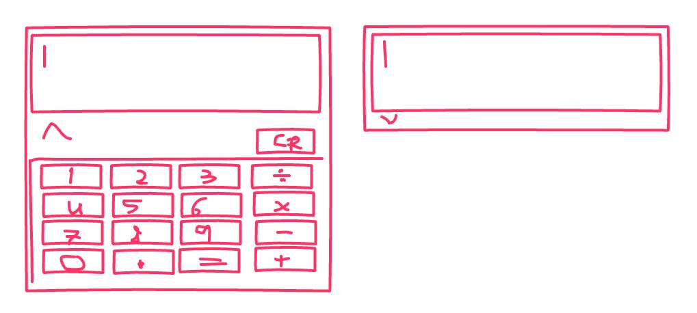
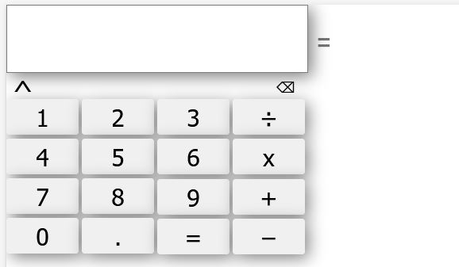
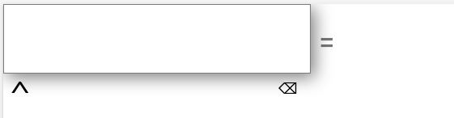

# Compile and run the project
- from the project root run wasm-pack build
- enter the www folder and run npm install
- then run npm run start
- Note:There is no need to rerun npm run start when modifying th js and html files
# Bugs
- When executing sqrt(x) by itself as an operation, we get error
- Floats are not supported
# Current Focus
- Implementing division by 0 detection DONE.
- implementing 4 callable functions for the primary functions DONE.
- Looking into libraries for designing UI
  - Using html, css, javascript, and web assembly instead Chosen.
- Fixing the issue of applying operations to parsed floats DONE.
- Implement a more complex parser that can handle more than 1 operation DONE.
  - The parser should start parsing from the left to the right and break down operations DONE.
- The current calculator does not calculate negative numbers ie -5 gives wrong result
- The current calculator does not support larger numbers
- The current calculator does not support degreed and radians nor does it support sin, cos, and tan

# Calculator In Rust 
 
 This is a calculator created in the rust programming language in order to learn the language.

## Aspects Of The Language To Learn

 - Lists
   - Arrays
   - Vectors
 - Implementation
 - Traits
 - Loops
 - TBD...

## What Should The Calculator Do?

The calculator should work in two modes:

### Simple Mode

This mode should be driven by a simple interface with buttons for numbers and button for addition, subtraction, multiplication, division.\
Components include:
- 10 buttons for the numbers 0-9
- 4 buttons for the operations
  - Addition
  - Subtraction
  - Multiplication
  - Division
- A locked text box that shows the current operation
- Only one operation can be queried

### Advances Mode

This mode should contain a text field that asks the user for input. The user should be able to enter free text and perform multiple operations simultaneously.\
Components include:
- Buttons that help the users know which operations are supported, examples are
  - sin, cos, tan, sqrt, x^a, ...

### General Syntax And Techniques

- Abstraction in the form of implementation
- Descriptive error codes
- TBD..

### Pictures

nanana
